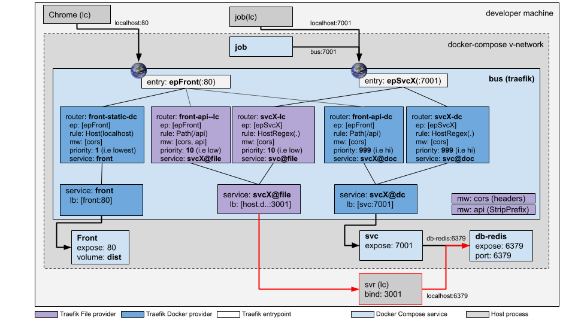

## Goal

```
+==================================+
|  +-----------+                   |    +=========+
|  | epFront   |   +--------------+|    | front:  |
|  | -------   |   | front service|---->|  nginx  |
|  |  Path:/   >-->+--------------+|    +=========+
|  |  Path:/api>-->+--------------+|    +=========+    +=========+
|  +-----------+   | svc service  |--+->| svc:    |-+->| db:     |
|traefik           +--------------+| |  |  nodejs | |  |  redis  |
+==================================+ |  +=========+ |  +=========+
docker network                       |              |
- - - - - - - - - - - - - - - - - - \|/ - - - - - - | - - - - - -
developer machine              +=========+          |
                               | svc(lc) |----------+
                               |  nodejs |
                               +=========+
```

Autodetect and decide - when `svc` container is down - route to `svc(lc)`.


## Build

The only thing you have to build is the `svr` container.

Build `svr` container

```
cd svr && npm i && npm run dockerize
```

## demo

1. once built, run the docker compose:
  ```
   docker-compose up -d
  ```
2. run svr in local-dev mode on your machine on port 3001
  ```
   node svr/index.js
  ```
  - Mind that the baked in default port is 3001, which is also the port used in
    the `buz/config/dynamic.http.yaml`.

3. browse to your `http://localhost`
4. try items `foo`, `bar` - expect reply from **compose**.
5. stop `svc`
  ```
   docker-compose stop svc
  ```
6. try items `foo`, `bar` - expect reply from **local** .
7. start `svc` 
  ```
   docker-compose start svc
  ```
8. try items `foo`, `bar` - expect reply from **compose**.

** NO RESTARTS REQUIRED ! **

## what's going on?



Whenever the `svc` container is running - it creates routers with higher priority
which serve reply from the container. These high priority routes "shadow" the
routes of the file provider.

Whenever the `svc` container is stopped - these routes are removed, and the
routes from the file provider take effect, and the reply is tried from your
local machine.


